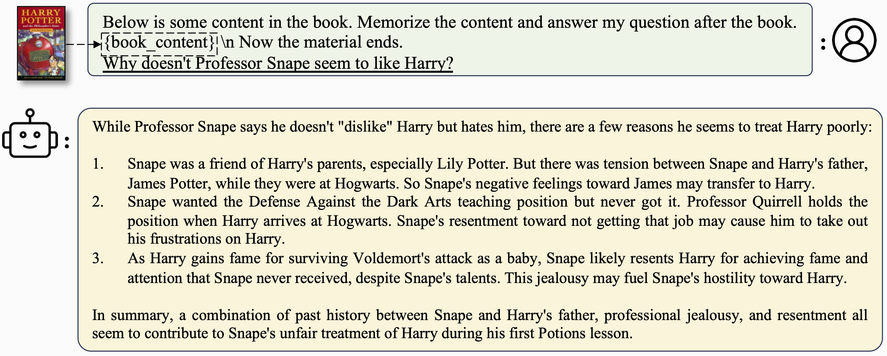
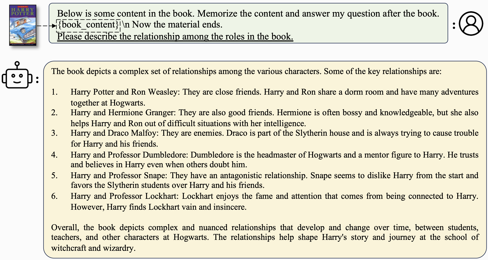
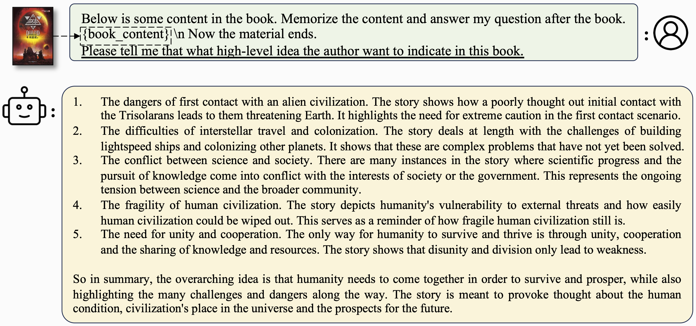
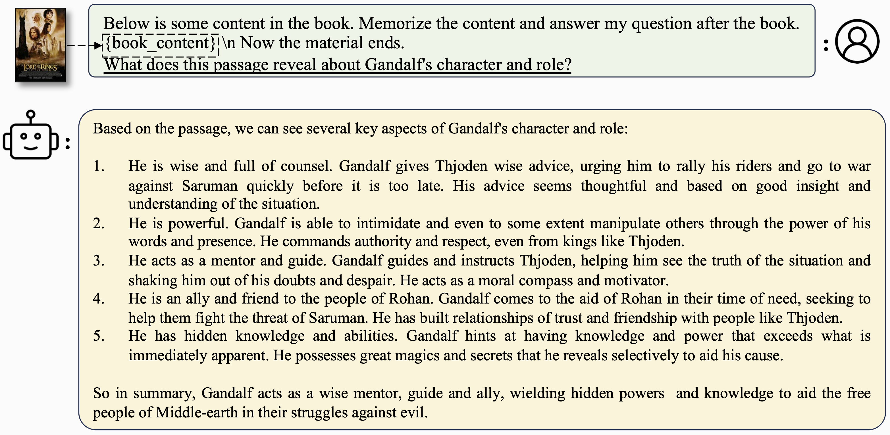
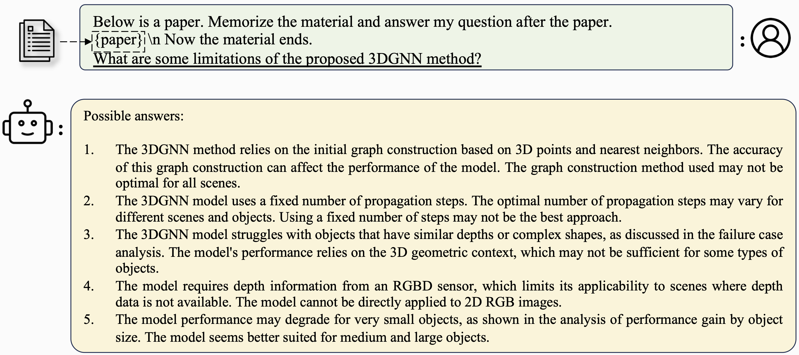
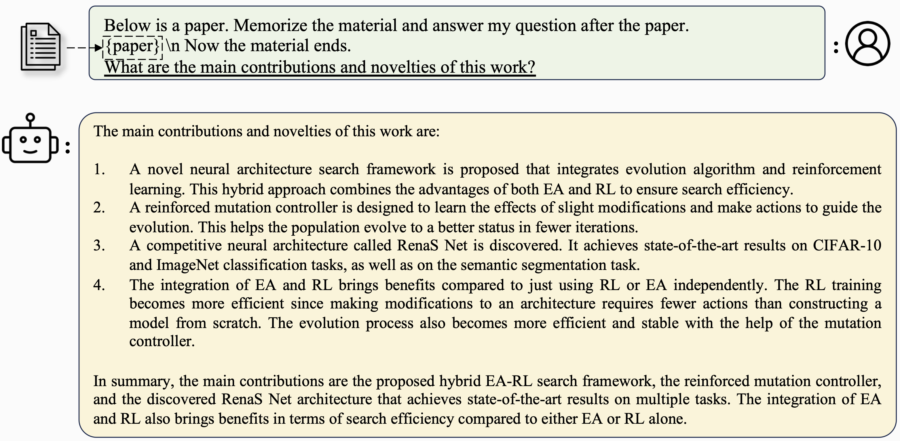

[](https://b3cfcf9e79ff42df5f.gradio.live)

# LongLoRA: Efficient Fine-tuning of Long-Context Large Language Models

<font size=7><div align='center' > <a href=>**Paper**</a> | <a href="https://huggingface.co/Yukang">**Models**</a> | [**Training**](#training) | [**Inference**](#inference) | <a href="https://b3cfcf9e79ff42df5f.gradio.live">**Online Demo**</a></div></font>

<p align="center">  </p>
<p align="center">  </p>
<p align="center">  </p>
<p align="center">  </p>
<p align="center">  </p>
<p align="center">  </p>


## News
- [x] [2023.9.22] We release our **13B and 70B 32k models with the supervised fine-tuning**, which is feasible for long context QA. Please check [Llama-2-13b-chat-longlora-32k-sft](https://huggingface.co/Yukang/Llama-2-13b-chat-longlora-32k-sft) and [Llama-2-70b-chat-longlora-32k-sft](https://huggingface.co/Yukang/Llama-2-70b-chat-longlora-32k-sft). Welcome to check them out!
- [x] [2023.9.22] We release all our fine-tuned [models](https://huggingface.co/Yukang), including **70B-32k models**, [LLaMA2-LongLoRA-70B-32k](https://huggingface.co/Yukang/Llama-2-70b-longlora-32k), [LLaMA2-LongLoRA-7B-100k](https://huggingface.co/Yukang/Llama-2-7b-longlora-100k-ft). Welcome to check them out!
- [x] [2023.9.22] We release [Paper]() and this GitHub repo, including training and evaluation code.

**LongLoRA: Efficient Fine-tuning of Long-Context Large Language Models [[Paper]()]** <br />
[Yukang Chen](https://scholar.google.com/citations?user=6p0ygKUAAAAJ&hl=en),
[Shengju Qian](https://scholar.google.com/citations?user=QNnWmasAAAAJ),
[Haotian Tang](https://scholar.google.com/citations?user=WxL13BAAAAAJ&hl),
[Xin Lai](https://scholar.google.com/citations?user=tqNDPA4AAAAJ&hl=zh-CN),
[Zhijian Liu](https://scholar.google.com/citations?user=3coYSTUAAAAJ&hl=en),
[Song Han](https://scholar.google.com/citations?user=E0iCaa4AAAAJ&hl=zh-CN),
[Jiaya Jia](https://scholar.google.com/citations?user=XPAkzTEAAAAJ&hl=en)<br />

## Abstract
We present LongLoRA, an efficient fine-tuning approach that extends the context sizes of pre-trained large language models (LLMs), with limited computation cost.
Typically, training LLMs with long context sizes is computationally expensive, requiring extensive training hours and GPU resources.
In this paper, we speed up the context extension of LLMs in two aspects. On the one hand, although dense global attention is needed during inference, fine-tuning the model can be effectively and efficiently done by sparse local attention. The proposed shift short attention effectively enables context extension, leading to non-trivial computation saving with similar performance to fine-tuning with vanilla attention. On the other hand, we find that LoRA for context extension works well under the premise of trainable embedding and normalization. LongLoRA demonstrates strong empirical results on various tasks on LLaMA2 models from 7B/13B to 70B. LongLoRA adopts LLaMA2 7B from 4k context to 100k, or LLaMA2 70B to 32k on a single 8x A100 machine. LongLoRA extends models' context while retaining their original architectures, and is compatible with most existing techniques, like FlashAttention-2. In addition, to make LongLoRA practical, we collect a dataset, LongQA, for supervised fine-tuning. It contains more than 3k long context question-answer pairs. For more details, please refer to the [paper]().


## Highlights
**LongLoRA** speed up the context extension of pre-trained large language models in both attention-level and weight-level.
1. The proposed shifted short attention is easy to implement, compatible with Flash-Attention, and not required during inference. 
2. We release all our models, including models from 7B to 70B, context length from 8k to 100k, including [LLaMA2-LongLoRA-7B-100k](https://huggingface.co/Yukang/Llama-2-7b-longlora-100k-ft), [LLaMA2-LongLoRA-13B-64k](https://huggingface.co/Yukang/Llama-2-13b-longlora-64k), and [LLaMA2-LongLoRA-70B-32k](https://huggingface.co/Yukang/Llama-2-70b-longlora-32k).
3. We build up a long-context QA dataset, LongQA, for supervised fine-tuning (SFT). We release 13B and 70B 32k models with SFT,  [Llama-2-13b-chat-longlora-32k-sft](https://huggingface.co/Yukang/Llama-2-13b-chat-longlora-32k-sft) and [Llama-2-70b-chat-longlora-32k-sft](https://huggingface.co/Yukang/Llama-2-70b-chat-longlora-32k-sft). We will further release the dataset next week.

## Installation
```
pip install -r requirements.txt
pip install flash-attn --no-build-isolation
```

## Released models

### Models with supervised fine-tuning
| Model                             | Size | Context | Train   | Link                                                                    |
|:----------------------------------|------|---------|---------|-------------------------------------------------------------------------|
| Llama-2-13b-chat-longlora-32k-sft | 13B  | 32768   | LoRA+   | [link](https://huggingface.co/Yukang/Llama-2-13b-chat-longlora-32k-sft) |
| Llama-2-70b-chat-longlora-32k-sft | 70B  | 32768   | LoRA+   | [link](https://huggingface.co/Yukang/Llama-2-70b-chat-longlora-32k-sft) |

### Models with context extension via fully fine-tuning
| Model                       | Size | Context | Train | Link                                                              |
|:----------------------------|------|---------|-------|-------------------------------------------------------------------|
| Llama-2-7b-longlora-8k-ft   | 7B   | 8192    | Full FT    | [link](https://huggingface.co/Yukang/Llama-2-7b-longlora-8k-ft)   |
| Llama-2-7b-longlora-16k-ft  | 7B   | 16384   | Full FT    | [link](https://huggingface.co/Yukang/Llama-2-7b-longlora-16k-ft)  |
| Llama-2-7b-longlora-32k-ft  | 7B   | 32768   | Full FT    | [link](https://huggingface.co/Yukang/Llama-2-7b-longlora-32k-ft)  |
| Llama-2-7b-longlora-100k-ft | 7B   | 100000  | Full FT    | [link](https://huggingface.co/Yukang/Llama-2-7b-longlora-100k-ft) |
| Llama-2-13b-longlora-8k-ft  | 13B  | 8192    | Full FT    | [link](https://huggingface.co/Yukang/Llama-2-13b-longlora-8k-ft)  |
| Llama-2-13b-longlora-16k-ft | 13B  | 16384   | Full FT    | [link](https://huggingface.co/Yukang/Llama-2-13b-longlora-16k-ft) |
| Llama-2-13b-longlora-32k-ft | 13B  | 32768   | Full FT    | [link](https://huggingface.co/Yukang/Llama-2-13b-longlora-32k-ft) |

### Models with context extension via improved LoRA fine-tuning
| Model                       | Size | Context | Train | Link                                                              |
|:----------------------------|------|---------|-------|-------------------------------------------------------------------|
| Llama-2-7b-longlora-8k      | 7B   | 8192    | LoRA+ | [link](https://huggingface.co/Yukang/Llama-2-7b-longlora-8k)      |
| Llama-2-7b-longlora-16k     | 7B   | 16384   | LoRA+ | [link](https://huggingface.co/Yukang/Llama-2-7b-longlora-16k)     |
| Llama-2-7b-longlora-32k     | 7B   | 32768   | LoRA+ | [link](https://huggingface.co/Yukang/Llama-2-7b-longlora-32k)     |
| Llama-2-13b-longlora-8k     | 13B  | 8192    | LoRA+ | [link](https://huggingface.co/Yukang/Llama-2-13b-longlora-8k)     |
| Llama-2-13b-longlora-16k    | 13B  | 16384   | LoRA+ | [link](https://huggingface.co/Yukang/Llama-2-13b-longlora-16k)    |
| Llama-2-13b-longlora-32k    | 13B  | 32768   | LoRA+ | [link](https://huggingface.co/Yukang/Llama-2-13b-longlora-32k)    |
| Llama-2-13b-longlora-64k    | 13B  | 65536   | LoRA+ | [link](https://huggingface.co/Yukang/Llama-2-13b-longlora-64k)    |
| Llama-2-70b-longlora-32k    | 70B  | 32768   | LoRA+ | [link](https://huggingface.co/Yukang/Llama-2-70b-longlora-32k)    |
| Llama-2-70b-chat-longlora-32k    | 70B  | 32768   | LoRA+ | [link](https://huggingface.co/Yukang/Llama-2-70b-chat-longlora-32k)    |

## Training
### Pre-trained weights
We use LLaMA2 models as the pre-trained weights and fine-tune them to long context window sizes. Please download [Llama-2-7b-hf](https://huggingface.co/meta-llama/Llama-2-7b-hf), [Llama-2-13b-hf](https://huggingface.co/meta-llama/Llama-2-7b-hf), and [Llama-2-7b-hf](https://huggingface.co/meta-llama/Llama-2-70b-hf), based on your choices.

### Fine-tuning
```
torchrun --nproc_per_node=8 fine-tune.py  \
        --model_name_or_path path_to/Llama-2-7b-hf \
        --bf16 True \
        --output_dir path_to_saving_checkpoints       \
        --cache_dir path_to_cache \
        --model_max_length 8192 \
        --use_flash_attn True \
        --low_rank_training False \
        --num_train_epochs 1  \
        --per_device_train_batch_size 1     \
        --per_device_eval_batch_size 2     \
        --gradient_accumulation_steps 8     \
        --evaluation_strategy "no"     \
        --save_strategy "steps"     \
        --save_steps 1000     \
        --save_total_limit 2     \
        --learning_rate 2e-5     \
        --weight_decay 0.0     \
        --warmup_steps 20     \
        --lr_scheduler_type "constant_with_warmup"     \
        --logging_steps 1     \
        --deepspeed "ds_configs/stage2.json" \
        --tf32 True \
        --max_steps 1000
```

- Please remember to change `path_to/Llama-2-7b-hf`, `path_to_saving_checkpoints`, `path_to_cache` to your own directory.
- Note that you can change `model_max_length` to other values.
- You could change `ds_configs/stage2.json` to `ds_configs/stage3.json` if you want.
- Please set `use_flash_attn` as `False` if you use V100 machines or do not install flash attention.
- You can set `low_rank_training` as `False` if you want to use fully fine-tuning. It will cost more GPU memory and slower, but the performance will be a bit better.
- When training is finished, to get the full model weight:
```
cd path_to_saving_checkpoints && python zero_to_fp32.py . pytorch_model.bin
```

### Supervised Fine-tuning
```
torchrun --nproc_per_node=8 supervised-fine-tune.py  \
        --model_name_or_path path_to_finetuned_models \
        --bf16 True \
        --output_dir path_to_saving_checkpoints       \
        --model_max_length 32768 \
        --use_flash_attn True \
        --data_path LongQA.json \
        --low_rank_training True \
        --num_train_epochs 3  \
        --per_device_train_batch_size 1     \
        --per_device_eval_batch_size 2     \
        --gradient_accumulation_steps 1     \
        --evaluation_strategy "no"     \
        --save_strategy "steps"     \
        --save_steps 1000     \
        --save_total_limit 2     \
        --learning_rate 2e-5     \
        --weight_decay 0.0     \
        --warmup_steps 20     \
        --lr_scheduler_type "constant_with_warmup"     \
        --logging_steps 1     \
        --deepspeed "ds_configs/stage2.json" \
        --tf32 True
```
- We typically make supervised fine-tuning upon the fine-tuned context extended models, `path_to_finetuned_models`, like `Llama-2-13b-longlora-32k` or `Llama-2-13b-longlora-32k-ft`.
- During our dataset colection, it is hard for us to collect many high-quality QA that are larger than 32768. Thus, if you use our `LongQA.json`, please also set `model_max_length` as 32768.


### Get trainable weights in low-rank training
In low-rank training, we set embedding and normalization layers as trainable. Please use the following line to extract the trainable weights `trainable_params.bin` from `pytorch_model.bin`
```
python3 get_trainable_weights.py --checkpoint_path path_to_saving_checkpoints --trainable_params "embed,norm"
```

### Merge LoRA Weight
Merge the LoRA weights of `pytorch_model.bin` and trainable parameters `trainable_params.bin`, save the resulting model into your desired path in the Hugging Face format:
```
python3 merge_lora_weights_and_save_hf_model.py \
        --base_model path_to/Llama-2-7b-hf \
        --peft_model path_to_saving_checkpoints \
        --context_size 8192 \
        --save_path path_to_saving_merged_model
```
For example,
```
python3 merge_lora_weights_and_save_hf_model.py \
        --base_model /dataset/pretrained-models/Llama-2-7b-hf \
        --peft_model /dataset/yukangchen/hf_models/lora-models/Llama-2-7b-longlora-8k \
        --context_size 8192 \
        --save_path /dataset/yukangchen/models/Llama-2-7b-longlora-8k-merged
```


### Validation
To evaluate a model that is trained in the low-rank setting, please set both `base_model` and `peft_model`. `base_model` is the pre-trained weight. `peft_model` is the path to the saved checkpoint, which should contain `trainable_params.bin`, `adapter_model.bin` and `adapter_config.json`. For example,
```
python3 eval.py --seq_len 8192 --context_size 8192 --batch_size 1 --base_model path_to/Llama-2-7b-hf --peft_model path_to_saving_checkpoints --data_path pg19/test.bin
```

To evaluate a model that is fully fine-tuned, you only need to set `base_model` as the path to the saved checkpoint, which should contain `pytorch_model.bin` and `config.json`. `peft_model` should be ignored.
```
python3 eval.py --seq_len 8192 --context_size 8192 --batch_size 1 --base_model path_to_saving_checkpoints --data_path pg19/test.bin
```

- Note that `--seq_len` is to set the sequence length for evaluation. `--context_size` is to set the context length of the model during fine-tuning. `--seq_len` should not be larger than `--context_size`.

- We have already tokenized the validation and test splits of PG19 and proof-pile dataset into `pg19/validation.bin`, `pg19/test.bin`, and `proof-pile/test_sampled_data.bin`, with the tokenizer of LLaMA. `proof-pile/test_sampled_data.bin` contains 128 documents that are randomly sampled from the total proof-pile test split. For each document, it has at least 32768 tokens. We also release the sampled ids in [proof-pile/test_sampled_ids.bin](https://drive.google.com/file/d/1cnzWODLRQYAd7HeugzLCIhaqzaLZv7J5/view?usp=share_link). You can download them from the links below.

| Dataset    | Split      | Link                                                                                                         |
|:-----------|------------|--------------------------------------------------------------------------------------------------------------|
| PG19       | validation | [pg19/validation.bin](https://drive.google.com/file/d/1rbJvb0qRIf2mQoN2ON7S93TbTzMnlrN6/view?usp=share_link) |
| PG19       | test       | [pg19/test.bin](https://drive.google.com/file/d/1QANDMdctpacPAYgS04adDXqByGEq-Ret/view?usp=share_link)       |
| Proof-pile | test       | [proof-pile/test_sampled_data.bin](https://drive.google.com/file/d/1bUI5lPDvrqzY_XXJJ2sSuvZx0Y9AZClE/view?usp=share_link)         |
 

## Inference 
To chat with [LLaMA2-LongLoRA-7B-100k](https://huggingface.co/Yukang/Llama-2-7b-longlora-100k-ft), [LLaMA2-LongLoRA-13B-64k](https://huggingface.co/Yukang/Llama-2-13b-longlora-64k), and [LLaMA2-LongLoRA-70B-32k](https://huggingface.co/Yukang/Llama-2-70b-longlora-32k):
```
python3 inference.py  \
        --base_model path_to_model \
        --question $question \
        --context_size $context_length \
        --max_gen_len $max_gen_len \
        --flash_attn True \
        --material $material_content \
        --material_type $material_type \
        --material_title $material_title
```

For example, if we want to ask a question related to a book:
```
python3 inference.py  \
        --base_model /data/models/Llama-2-13b-chat-longlora-32k-sft \
        --question "Why doesn't Professor Snape seem to like Harry?" \
        --context_size 32768 \
        --max_gen_len 512 \
        --flash_attn True \
        --material "materials/Harry Potter and the Philosophers Stone_section2.txt" \
        --material_type "book" \
        --material_title "Harry Potter and the Philosophers Stone"
```
Note that you can ignore `material_type` or `material_title`.

If we want to ask a question related to a paper:
```
python3 inference.py  \
        --base_model /data/models/Llama-2-13b-chat-longlora-32k-sft \
        --question "What are the main contributions and novelties of this work?" \
        --context_size 32768 \
        --max_gen_len 512 \
        --flash_attn True \
        --material "materials/paper1.txt" \
        --material_type "paper"
```

## Demo
If you want to deploy your own demo, you can run the 
```
python3 demo.py  \
	--base_model path_to_model \
	--context_size $context_size \
	--max_gen_len $max_gen_len \
	--flash_attn True
```
For example, 
```
python3 demo.py  \
	--base_model /data/models/Llama-2-13b-chat-longlora-32k-sft \
	--context_size 32768 \
	--max_gen_len 512 \
	--flash_attn True
```
- Note that `flash_attn=True` will make the generation slow but save much GPU memory.

## Pdf2text
During our dataset collection, we convert paper and books from pdf to text. The conversion quality has a large influence on the final model quality. We think that this step is non-trivial. We release the tool for the pdf2txt conversion, in the folder `pdf2txt`. It is built upon `pdf2image`, `easyocr`, `ditod` and `detectron2`. Please refer to the [README.md](pdf2txt/README.md) in `pdf2txt` for more details.

## Citation 
If you find this project useful in your research, please consider citing:

```
@article{longlora,
  title={LongLoRA: Efficient Fine-tuning of Long-Context Large Language Models},
  author={Yukang Chen and Shengju Qian and Haotian Tang and Xin Lai and Zhijian Liu and Song Han and Jiaya Jia},
  journal={arXiv},
  year={2023}
}
```

## Acknowledgement
-  This work is built upon the [LLaMA2](https://ai.meta.com/llama) as the pre-trained models.
- This work is based on [DeepSpeed](https://github.com/microsoft/DeepSpeed), [peft](https://github.com/huggingface/peft), and [Flash-Attention2](https://github.com/Dao-AILab/flash-attention) for acceleration.
- The perplexity evaluation code is modified upon [Landmark Attention](https://github.com/epfml/landmark-attention).
- We use [LongChat](https://github.com/DachengLi1/LongChat) for the retrieval evaluation.

